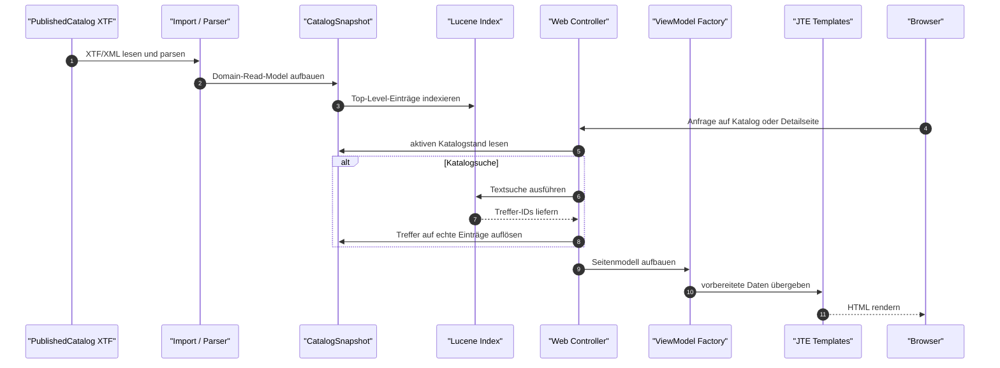

# Datenportal Webapp

Serverseitig gerenderte Datenportal-Webanwendung für den Kanton Solothurn.

## MVP-Status

Die Anwendung lädt PublishedCatalog-XTF/XML, baut einen immutable `CatalogSnapshot` und einen Lucene-Index, rendert Katalog- und Detailseiten mit Spring Boot, JTE und HTMX und integriert Header/Breadcrumb über vendorte `so-web-components`.

Enthalten:

- Java 25
- Spring Boot 4.1.0
- Gradle Groovy DSL
- JTE-Templates im Development-Mode
- lokal vendortes HTMX
- lokal vendortes `so-web-components@0.1.10`
- Katalogseite auf `/` und `/datasets`
- Lucene-backed Suche, Sortierung und Filter
- Listenansicht, Kartenansicht und Datenreihen-Expansion
- Detailseiten für Datensätze, Datenreihen und Ausgaben
- Classpath-, Datei- und HTTP-Katalogquelle
- geschützter Runtime-Reload unter `/admin/catalog/reload`
- Status unter `/admin/catalog/status`
- kontrollierte 404- und Fehlerseiten
- Actuator Health/Info
- Cache-Header für statische Assets
- grundlegende Security-Header

Nicht enthalten:

- Datenbank
- Login-System
- Admin-UI
- Docker-/Kubernetes-Deployment
- CI/CD-Pipeline
- Datenvorschau

## Voraussetzungen

- JDK 25

Der Build verwendet den Gradle Wrapper; eine lokale Gradle-Installation ist nicht erforderlich.

## Starten

```bash
./gradlew bootRun
```

Danach erreichbar:

- `http://localhost:8080/`
- `http://localhost:8080/datasets`
- `http://localhost:8080/actuator/health`
- `http://localhost:8080/actuator/info`

Bei belegtem Port:

```bash
./gradlew bootRun --args='--server.port=8081'
```

## Dokumentationslandkarte

Die Dokumentation ist nach Zweck getrennt, damit Einstieg, Laufzeit, Betrieb und UI-Regeln nicht in einer einzigen Datei vermischt werden.

- `README.md`: Einstieg, Quickstart, MVP-Überblick und grober Datenfluss.
- `docs/architecture.md`: technischer Laufzeitaufbau, Datenfluss vom XTF bis ins Rendering und atomarer Reload.
- `docs/configuration.md`: Laufzeit-Properties, Katalogquellen, Reload-Token, Actuator, Cache und Security-Header.
- `docs/operations.md`: lokaler Betrieb, Reload, Health/Info, Fehlerdiagnose und Smoke-Tests.
- `docs/search.md`: fachliche Soll-Semantik der Suche und Filter.
- `docs/ui-implementation-contract.md`: verbindlicher UI-Vertrag für Katalog-, Karten- und Detailseiten.
- `docs/ui-primitives.md`: Source of truth für Chips, Badges und Action Pills.
- `docs/component-map.md`: Zuordnung von UI-Bereichen zu JTE-Templates, ViewModels und Tests.
- `AGENTS.md`: Arbeitsregeln, verpflichtende Referenzen und Repo-Grenzen für Coding-Agents.
- `datenportal_webapp_agent_spec_detailed_v5.md`: vollständige Soll-Spezifikation mit Architektur, Klassenbild und Phasenmodell.

## Konfiguration

Standardkonfiguration in `src/main/resources/application.yml`:

```yaml
datenportal:
  catalog:
    source-type: classpath
    classpath-location: published_catalog_full_54_entries.xtf
  admin:
    reload-token: ${DATENPORTAL_ADMIN_RELOAD_TOKEN:}
  search:
    max-results: 500
    default-page-size: 20
    max-page-size: 100
  web-components:
    enabled: true
    version: "0.1.10"
    asset-base-path: "/vendor/so-web-components/0.1.10"
    use-cdn: false
```

Die Datei `spec/fixtures/published_catalog_full_54_entries.xtf` ist als Main-Resource auf dem Classpath eingebunden.

Weitere Details:

- `docs/configuration.md`
- `docs/operations.md`
- `docs/web-components.md`
- `docs/architecture.md`

## Wie Daten ins GUI kommen

Die Anwendung liest das PublishedCatalog-XTF vollständig ein, überführt es in ein internes Read-Model und rendert daraus sowohl die Suchresultate als auch die Detailseiten. Lucene dient dabei der Katalogsuche; Detailseiten lesen ihren Eintrag direkt aus dem aktiven Snapshot.



## Reload

```bash
export DATENPORTAL_ADMIN_RELOAD_TOKEN='change-me'
./gradlew bootRun
```

```bash
curl -X POST \
  -H "X-Reload-Token: ${DATENPORTAL_ADMIN_RELOAD_TOKEN}" \
  http://localhost:8080/admin/catalog/reload
```

Status:

```bash
curl \
  -H "X-Reload-Token: ${DATENPORTAL_ADMIN_RELOAD_TOKEN}" \
  http://localhost:8080/admin/catalog/status
```

## Checks

```bash
./gradlew test
./gradlew check
```

Für den lokalen Smoke-Test siehe `docs/operations.md`.

## Relevante Dokumente

- `AGENTS.md`
- `datenportal_webapp_agent_spec_detailed_v5.md`
- `docs/ui-implementation-contract.md`
- `docs/component-map.md`
- `docs/architecture.md`
- `docs/configuration.md`
- `docs/operations.md`
- `docs/web-components.md`
