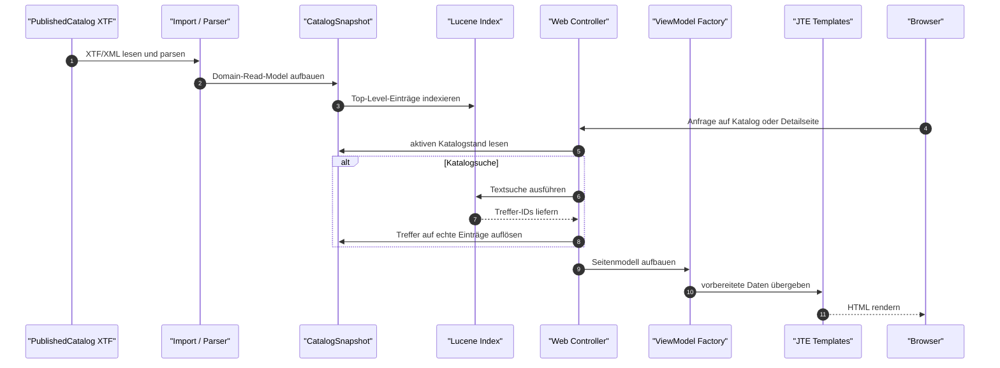

# Datenportal Webapp

Serverseitig gerenderte Datenportal-Webanwendung für den Kanton Solothurn.

## MVP-Status

Die Anwendung lädt PublishedCatalog-XTF/XML, baut einen immutable `CatalogSnapshot` und einen Lucene-Index, rendert Katalog- und Detailseiten mit Spring Boot, JTE und HTMX und integriert Header/Breadcrumb über vendorte `so-web-components`.

Enthalten:

- Java 25
- Spring Boot 4.1.0
- Gradle Groovy DSL
- JTE-Templates mit produktionssicherem Standard und explizitem Local-Mode
- lokal vendortes HTMX
- lokal vendortes `so-web-components@0.1.10`
- Katalogseite auf `/` und `/datasets`
- Lucene-backed Suche, Sortierung und Filter
- Listenansicht, Kartenansicht und Datenreihen-Expansion
- Detailseiten für Datensätze, Datenreihen und Ausgaben
- Classpath-, Datei-, HTTP- und Manifest-Katalogquelle
- Explore-Schema-Explorer mit DuckDB-Catalog-Artefakt
- geschützter Runtime-Reload unter `/admin/catalog/reload`
- Status unter `/admin/catalog/status`
- kontrollierte 404- und Fehlerseiten
- Actuator Health/Info
- Cache-Header für statische Assets
- grundlegende Security-Header

Nicht enthalten:

- serverseitige Datenbank für veränderliche Anwendungsdaten
- Login-System
- Admin-UI
- Kubernetes-Deployment und Publish-Workflow für Containerimages
- CI/CD-Pipeline
- Erzeugung von `catalog.duckdb` in der Webapp (diese übernimmt GRETL im Themenrepo)

Für den lokalen JVM-Betrieb als Container existiert ein Dockerfile im
Repository; Details stehen in [Container-Deployment](docs/container-deployment.md).

## Voraussetzungen

- JDK 25
- Node.js und npm im `PATH` für den von Gradle gestarteten Explore-Build;
  der gesperrte Vite-Stand benötigt Node `^20.19.0 || >=22.12.0`.

Der Build verwendet den Gradle Wrapper; eine lokale Gradle-Installation ist nicht erforderlich.
Beim ersten Build werden Gradle-/npm-Abhängigkeiten und WebR-Artefakte geladen.

## Starten

```bash
SPRING_PROFILES_ACTIVE=local ./gradlew bootRun
```

Danach erreichbar:

- `http://localhost:8080/`
- `http://localhost:8080/datasets`
- `http://localhost:8080/actuator/health`
- `http://localhost:8080/actuator/health/liveness`
- `http://localhost:8080/actuator/health/readiness`
- `http://localhost:8080/actuator/info`

Bei belegtem Port:

```bash
SPRING_PROFILES_ACTIVE=local ./gradlew bootRun --args='--server.port=8082'
```

Der Standardstart verwendet gebündelte Fixtures. Im lokalen Gesamtstack
(`datenportal-dev-stack`) läuft das Portal als Container auf **8082** mit
gemeinsamer Manifestquelle für XTF und DuckDB; der Stack baut und startet das
Image aus diesem Repository. Die Host-Variante bleibt als Alternative
dokumentiert in [Betrieb](docs/operations.md#an-den-lokalen-dev-stack-anschliessen).

Container-Schnellstart mit den gebündelten Fixtures:

```bash
docker build -t datenportal-sodata:local .
docker run --rm -p 18082:8080 \
  -e DATENPORTAL_CATALOG_SOURCE_TYPE=classpath \
  -e DATENPORTAL_CATALOG_CLASSPATH_LOCATION=published_catalog_full_62_entries.xtf \
  -e DATENPORTAL_CATALOG_DUCKDB_SOURCE_TYPE=classpath \
  -e DATENPORTAL_CATALOG_DUCKDB_CLASSPATH_LOCATION=catalog.duckdb \
  datenportal-sodata:local
```

Das Profil `local` ist für den Host-`bootRun` gedacht; im Container werden die
vorkompilierten Templates und die explizit konfigurierten Fixtures verwendet.

## Dokumentationslandkarte

Die Dokumentation ist nach Zweck getrennt, damit Einstieg, Laufzeit, Betrieb und UI-Regeln nicht in einer einzigen Datei vermischt werden.

- `README.md`: Einstieg, Quickstart, MVP-Überblick und grober Datenfluss.
- `docs/architecture.md`: technischer Laufzeitaufbau, Datenfluss vom XTF bis ins Rendering und atomarer Reload.
- `docs/configuration.md`: Laufzeit-Properties, Katalogquellen, Reload-Token, Actuator, Cache und Security-Header.
- `docs/operations.md`: lokaler Betrieb, Reload, Health/Info, Fehlerdiagnose und Smoke-Tests.
- `docs/container-deployment.md`: JVM-Containerimage, Build, Laufzeitkonfiguration, Dev-Stack-Betrieb und Ausblick GraalVM Native.
- `docs/search.md`: fachliche Soll-Semantik der Suche und Filter.
- `docs/ui-implementation-contract.md`: verbindlicher UI-Vertrag für Katalog-, Karten- und Detailseiten.
- `docs/ui-primitives.md`: Source of truth für Chips, Badges und Action Pills.
- `docs/component-map.md`: Zuordnung von UI-Bereichen zu JTE-Templates, ViewModels und Tests.
- `AGENTS.md`: Arbeitsregeln, verpflichtende Referenzen und Repo-Grenzen für Coding-Agents.
- `datenportal_webapp_agent_spec_detailed_v5.md`: vollständige Soll-Spezifikation mit Architektur, Klassenbild und Phasenmodell.

## Konfiguration

Lokale Konfiguration in `src/main/resources/application-local.yml`:

```yaml
datenportal:
  catalog:
    source-type: classpath
    classpath-location: published_catalog_full_62_entries.xtf
    duckdb:
      source-type: classpath
      classpath-location: catalog.duckdb
      schema: opendata
  admin:
    reload-token: ${DATENPORTAL_ADMIN_RELOAD_TOKEN:}
  search:
    default-page-size: 10
    max-page-size: 100
  web-components:
    enabled: true
    version: "0.1.10"
    asset-base-path: "/vendor/so-web-components/0.1.10"
    use-cdn: false
```

Die Basiskonfiguration enthält absichtlich keine Katalogquelle. Ein Start ohne
explizites Profil oder externe Quellkonfiguration schlägt früh fehl. Die
Dateien `spec/fixtures/published_catalog_full_62_entries.xtf` und
`spec/fixtures/catalog.duckdb` sind als Main-Resources auf dem Classpath
eingebunden und werden nur über `local` beziehungsweise `test` aktiviert.

Weitere Details:

- `docs/configuration.md`
- `docs/operations.md`
- `docs/web-components.md`
- `docs/architecture.md`

## Wie Daten ins GUI kommen

Der PublishedCatalog darf `draft`, `in_review`, `published` und `archived`
enthalten. Der vollständige Eingang wird zuerst validiert; unbekannte Statuswerte
bleiben Fehler. Anschliessend übernimmt die öffentliche Sicht nur veröffentlichte
Datensätze sowie Ausgaben, deren Serie ebenfalls veröffentlicht ist. Serien ohne
sichtbare Ausgabe entfallen. Suche, Zähler, Detailzugriffe und Auswahl der aktuellen
Ausgabe verwenden ausschliesslich diese Sicht. Ein gültiger vollständig
zurückgehaltener Katalog führt zu einer leeren öffentlichen Sicht.
Die vollständige Quelldatei bleibt unverändert und kann über den Katalog-Download
weiterhin auch zurückgehaltene Einträge offenlegen.

Die Quelle `datenportal.catalog.source-type=manifest` löst eine unter
`datenportal.catalog.http-url` konfigurierte `current.json` auf. Details zu
Erstinitialisierung ohne Katalog und zum gemeinsamen DuckDB-Manifestmodus stehen
in [Konfiguration](docs/configuration.md#veröffentlichungsverweis-auf-s3).

Die Anwendung liest das PublishedCatalog-XTF vollständig ein, überführt es in ein internes Read-Model und rendert daraus sowohl die Suchresultate als auch die Detailseiten. Lucene dient dabei der Katalogsuche; Detailseiten lesen ihren Eintrag direkt aus dem aktiven Snapshot.



## Reload

```bash
: "${DATENPORTAL_ADMIN_RELOAD_TOKEN:?Externes Reload-Secret bereitstellen}"
export DATENPORTAL_ADMIN_RELOAD_TOKEN
SPRING_PROFILES_ACTIVE=local ./gradlew bootRun
```

```bash
curl -X POST \
  -H "X-Reload-Token: ${DATENPORTAL_ADMIN_RELOAD_TOKEN}" \
  http://localhost:8080/admin/catalog/reload
```

Status:

```bash
curl \
  -H "X-Reload-Token: ${DATENPORTAL_ADMIN_RELOAD_TOKEN}" \
  http://localhost:8080/admin/catalog/status
```

## Checks

```bash
./gradlew test
./gradlew check
```

Für den lokalen Smoke-Test siehe `docs/operations.md`.

## Relevante Dokumente

- `AGENTS.md`
- `datenportal_webapp_agent_spec_detailed_v5.md`
- `docs/ui-implementation-contract.md`
- `docs/component-map.md`
- `docs/architecture.md`
- `docs/configuration.md`
- `docs/operations.md`
- `docs/web-components.md`
