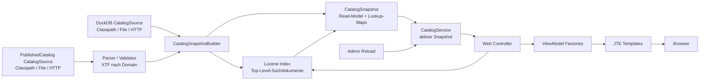
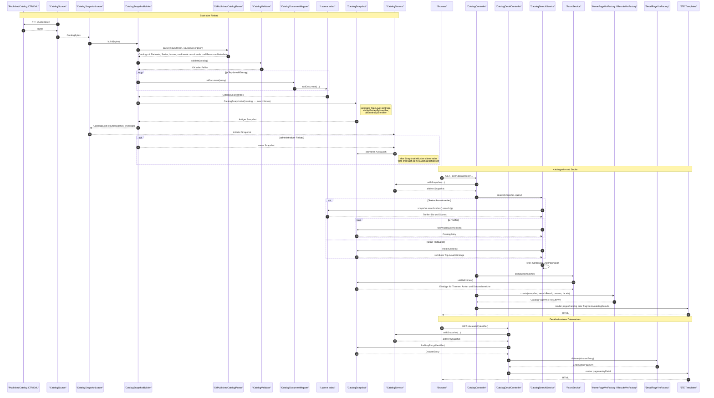

# Architektur

Die Anwendung ist eine serverseitig gerenderte Spring-Boot-Webanwendung mit JTE, HTMX als Progressive Enhancement, `so-web-components` für Header/Breadcrumb und einem immutable In-Memory-Katalog.

## Systemübersicht

Die zentrale Architekturidee ist ein vollständiger, atomar austauschbarer `CatalogSnapshot`. Parser, Validierung und Lucene-Indexing bauen immer erst einen neuen Kandidaten auf; veröffentlicht wird erst der komplette, konsistente Stand.



## Laufzeitmodell

Beim Start oder Reload werden die PublishedCatalog-XTF/XML-Quelle und die
fertige DuckDB-Datei jeweils genau einmal geladen. XTF wird sicher geparst und
validiert, der Lucene-Index wird vollständig neu gebaut, und erst danach
werden beide Artefakte gemeinsam mit dem Domain-Read-Model als
`CatalogSnapshot` veröffentlicht. Die Anwendung erzeugt oder transformiert
`catalog.duckdb` nicht.

Der aktive Snapshot enthält:

- normale Datensätze
- Datenreihen
- Ausgaben von Datenreihen
- sichtbare Top-Level-Einträge
- Lookup-Maps für Detailseiten
- unveränderliche `publishedCatalog`- und `duckDbCatalog`-Bytes
- Ladezeitpunkt, Ladezeit, Source-Beschreibung und XTF-Content-Hash
- aktiven `CatalogSearchIndex`

`CatalogService` hält den Snapshot in-memory und tauscht ihn atomar unter einem Read/Write-Lock. Öffentliche Controller verwenden `withSnapshot(...)`, damit Suche, Facetten und ViewModel-Aufbau konsistent denselben Katalogstand sehen.

## Materialisierte Pakete

```text
ch.so.agi.datenportal
  admin.actuator
  admin.reload
  catalog.domain
  catalog.importxtf
  catalog.service
  config
  search
  support
  web
  web.view
```

Wichtige Verantwortlichkeiten:

- `catalog.importxtf`: Katalogquellen, Byte-Lesen, XTF/XML-Parser, XML-Sicherheit und Validierung.
- `catalog.service`: Snapshot-Building, initialer Load, atomarer Reload und aktiver Snapshot.
- `search`: Lucene-Dokumente, Indexaufbau, Suche, Filter, Sortierung und Facetten.
- `web`: Controller, Query-Parameter, ViewModel-Factories, Page Chrome, Fehlerseiten.
- `admin.reload`: geschützte JSON-Endpunkte für Reload und Status.
- `admin.actuator`: Health- und Info-Beiträge für Betrieb.
- `config`: Properties, statisches Asset-Caching und Security-Header.

## Startup

1. Spring bindet `datenportal.catalog.*`.
2. Die XTF- und DuckDB-`CatalogSource` laden ihre vollständigen Bytes jeweils einmal.
3. Der DuckDB-Header wird technisch auf mindestens zwölf Bytes und `DUCK` an Byteposition 8 bis 11 geprüft.
4. `XtfPublishedCatalogParser` parst namespace-aware und XXE-sicher, inklusive exakter `accessRights` sowie strukturbezogener Metadaten (`attributes`, `model`).
5. `CatalogValidator` prüft Pflichtregeln.
6. `CatalogSearchIndexBuilder` baut einen neuen In-Memory-Lucene-Index.
7. `CatalogSnapshotBuilder` erzeugt den immutable `CatalogSnapshot` mit beiden Artefakten.
8. `CatalogService` stellt den Snapshot für Web, Suche, Explore, Artefakte und Actuator bereit.

Fehlschläge beim initialen Laden sind fail-fast. Die Anwendung startet nicht still mit leerem Katalog.

## Reload

`POST /admin/catalog/reload` ist über `X-Reload-Token` geschützt. Der Token stammt aus `datenportal.admin.reload-token`, typischerweise `DATENPORTAL_ADMIN_RELOAD_TOKEN`.

Reload-Ablauf:

1. XTF- und DuckDB-Quelle laden.
2. DuckDB minimal technisch prüfen.
3. XTF-Kandidat parsen.
4. Kandidat validieren.
5. Kandidaten-Index bauen.
6. Kandidaten-Snapshot mit beiden Artefakten erzeugen.
7. Snapshot, Index und Artefakte atomar veröffentlichen.

Bei Fehlern bleibt der alte Snapshot samt altem Lucene-Index und alter
DuckDB-Datei aktiv. Parallel laufende Reloads werden mit `409 Conflict`
abgelehnt. Die Anwendung garantiert die atomare Aktivierung der gemeinsam
geladenen Artefakte, kann ohne externes Release-Manifest aber nicht beweisen,
dass XTF und DuckDB fachlich denselben Datenstand enthalten; dafür ist die
externe Publishing-Pipeline verantwortlich.

## Katalog-Artefakte und Explore-Versionierung

`CatalogArtifactController` liest beide ausgelieferten Dateien ausschließlich
aus dem aktiven Snapshot. Er lädt keine Source pro HTTP-Request, verwendet den
SHA-256-Hash als ETag und liefert die gespeicherte Content-Length. Ein
unversionierter DuckDB-Aufruf bleibt `no-cache`; ein Aufruf mit
`?v=<sha256>` erhält `public, immutable`-Caching. Veraltete Versionsparameter
werden mit `409 Conflict` abgewiesen, ein passendes `If-None-Match` liefert
`304 Not Modified`. Der Explore-Kontext erzeugt die DuckDB-URL aus genau dem
Hash desselben Snapshots.

## Detaillierter Datenfluss vom XTF bis ins GUI

Das folgende Sequenzdiagramm beschreibt den heutigen Ist-Zustand der Laufzeitkette. Wichtig dabei: Lucene dient der Katalogsuche, nicht als primäre Quelle für Detailseiten. Detailseiten lesen ihre Einträge direkt aus dem aktiven Snapshot. Trefferlisten werden nach der Lucene-Suche wieder über Treffer-IDs auf `CatalogEntry`-Objekte im Snapshot aufgelöst.



## Web Layer

Die Katalogseite auf `/` und `/datasets` rendert Suche, Mehrfachfilter, Listenansicht, Kartenansicht und HTMX-Fragmente. Detailseiten liegen unter:

```text
/datasets/{identifier}
/series/{seriesIdentifier}
/series/{seriesIdentifier}/issues/current
/series/{seriesIdentifier}/issues/{issueIdentifier}
```

Die fachliche Soll-Semantik der Katalogsuche ist in [search.md](search.md) beschrieben.

JTE-Templates erhalten nur vorbereitete ViewModels. Fachlogik bleibt in Domain, Services und Factories.

## Fehlerseiten

Fachliche 404s über `CatalogNotFoundException`, statische 404s und der generische Boot-Fehlerpfad werden kontrolliert gerendert:

- `pages/notFound.jte` für 404
- `pages/error.jte` für 5xx und andere Fehler

Beide nutzen den normalen Page Chrome mit Header/Breadcrumb. Stacktraces, Exception-Klassen und interne Pfade werden nicht an Nutzer ausgeliefert.

## Actuator

Exponiert sind nur:

```text
/actuator/health
/actuator/info
```

Eigene Health-Komponenten:

- `catalogSnapshot`: aktiver Snapshot und Counts.
- `catalogReload`: Reload-Laufstatus und letzter erfolgreicher/fehlgeschlagener Reload.
- `catalogSearchIndex`: Verfügbarkeit des aktiven Lucene-Index.

Der Info-Endpunkt enthält App-Name, Package-Basis, Java-Version und optional Gradle-Build-Informationen.

## Static Assets und Header

Statische CSS-, HTMX-, Web-Component-, Font- und optionale Bildpfade werden über `StaticAssetCachingConfiguration` mit Cache-Headern ausgeliefert. Versionierte Web-Component-Assets erhalten eine lange TTL, nicht fingerprinted CSS eine kurze TTL.

`SecurityHeadersConfiguration` setzt grundlegende sichere Response-Header:

- `X-Content-Type-Options`
- `Referrer-Policy`
- `X-Frame-Options`
- `Permissions-Policy`
- `Content-Security-Policy`

## Bewusste Grenzen

- Keine Datenbank.
- Kein Login-System.
- Kein Admin-UI.
- Keine CI/CD-Pipeline.
- Keine Datenvorschau.
- Keine fachlichen Such- oder UI-Erweiterungen in Phase 8.
