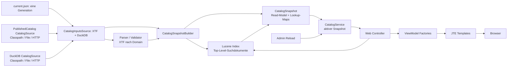
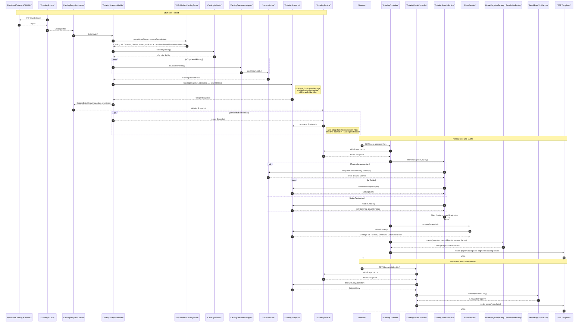

# Architektur

Die Anwendung ist eine serverseitig gerenderte Spring-Boot-Webanwendung mit JTE, HTMX als Progressive Enhancement, `so-web-components` für Header/Breadcrumb und einem immutable In-Memory-Katalog.

## Systemübersicht

Die zentrale Architekturidee ist ein vollständiger, atomar austauschbarer `CatalogSnapshot`. Parser, Validierung und Lucene-Indexing bauen immer erst einen neuen Kandidaten auf; veröffentlicht wird erst der komplette, konsistente Stand.


```mermaid
flowchart LR
    manifest["current.json: eine Generation"]
    inputs["CatalogInputsSource: XTF + DuckDB"]
    manifest --> inputs
    inputs --> parser
    inputs --> builder
    xtf["PublishedCatalog CatalogSource<br/>Classpath / File / HTTP"]
    duckdb["DuckDB CatalogSource<br/>Classpath / File / HTTP"]
    parser["Parser / Validator<br/>XTF nach Domain"]
    builder["CatalogSnapshotBuilder"]
    snapshot["CatalogSnapshot<br/>Read-Model + Lookup-Maps"]
    lucene["Lucene Index<br/>Top-Level-Suchdokumente"]
    service["CatalogService<br/>aktiver Snapshot"]
    web["Web Controller"]
    vm["ViewModel Factories"]
    jte["JTE Templates"]
    browser["Browser"]
    admin["Admin Reload"]

    xtf --> inputs
    duckdb --> inputs
    parser --> builder
    builder --> lucene
    builder --> snapshot
    lucene --> snapshot
    snapshot --> service
    admin --> service
    service --> web
    web --> vm
    vm --> jte
    jte --> browser
    web --> lucene
```

## Laufzeitmodell

Beim Start oder Reload werden die PublishedCatalog-XTF/XML-Quelle und die
fertige DuckDB-Datei jeweils genau einmal geladen. Im gemeinsamen Manifestmodus
liefert `CatalogInputsSource` beide Artefakte aus einer einzigen Auflösung von
`current.json`; Start und Reload verwenden dieselbe Ladeabstraktion. XTF wird sicher geparst und
validiert, der Lucene-Index wird vollständig neu gebaut, und erst danach
werden beide Artefakte gemeinsam mit dem Domain-Read-Model als
`CatalogSnapshot` veröffentlicht. Die Anwendung erzeugt oder transformiert
`catalog.duckdb` nicht.

Der aktive Snapshot enthält:

- normale Datensätze
- Datenreihen
- Ausgaben von Datenreihen
- sichtbare Top-Level-Einträge
- Lookup-Maps für Detailseiten
- unveränderliche `publishedCatalog`- und `duckDbCatalog`-Bytes
- Ladezeitpunkt, Ladezeit, Source-Beschreibung und XTF-Content-Hash
- aktiven `CatalogSearchIndex`

`CatalogService` hält den Snapshot in-memory und tauscht ihn atomar unter einem Read/Write-Lock. Öffentliche Controller verwenden `withSnapshot(...)`, damit Suche, Facetten und ViewModel-Aufbau konsistent denselben Katalogstand sehen.

## Materialisierte Pakete

```text
ch.so.agi.datenportal
  admin.actuator
  admin.reload
  catalog.domain
  catalog.importxtf
  catalog.service
  config
  search
  support
  web
  web.view
```

Wichtige Verantwortlichkeiten:

- `catalog.importxtf`: Katalogquellen, Byte-Lesen, XTF/XML-Parser, XML-Sicherheit und Validierung.
- `catalog.service`: Snapshot-Building, initialer Load, atomarer Reload und aktiver Snapshot.
- `search`: Lucene-Dokumente, Indexaufbau, Suche, Filter, Sortierung und Facetten.
- `web`: Controller, Query-Parameter, ViewModel-Factories, Page Chrome, Fehlerseiten.
- `admin.reload`: geschützte JSON-Endpunkte für Reload und Status.
- `admin.actuator`: Health- und Info-Beiträge für Betrieb.
- `config`: Properties, statisches Asset-Caching und Security-Header.

Beschreibende Metadaten verwenden das [eingeschränkte Markdown-Profil](metadata-text.md).
Der XTF-Parser behält den Quelltext einschliesslich innerer Zeilenumbrüche;
`Catalog.description` bleibt auch in der veröffentlichten Sicht erhalten.
`support.metadata` wandelt Beschreibungen mit CommonMark in eine unveränderliche
Dokumentstruktur um. ViewModel-Factories verwenden vollständiges oder kompaktes
HTML; nur der Renderer erzeugt den dafür vorgesehenen JTE-Inhaltstyp.
Lucene und Explore verwenden die Klartextdarstellung. Eine PDF-Darstellung
kann später auf derselben Dokumentstruktur aufbauen.

## Startup

1. Spring bindet `datenportal.catalog.*`.
2. `CatalogInputsSource` lädt beide Artefakte; im Manifestmodus stammen sie aus derselben einmaligen Manifestauflösung.
3. Der DuckDB-Header wird technisch auf mindestens zwölf Bytes und `DUCK` an Byteposition 8 bis 11 geprüft.
4. `XtfPublishedCatalogParser` parst namespace-aware und XXE-sicher, inklusive exakter `accessRights` sowie strukturbezogener Metadaten (`attributes`, `model`). Für die BAG-Rolle `attributes` liest er alle `DatasetAttribute`-Kinder eines Containers in Dokumentreihenfolge; wiederholte `attributes`-Container bleiben ebenfalls unterstützt.
5. `CatalogValidator` prüft Pflichtregeln.
6. `CatalogSearchIndexBuilder` baut einen neuen In-Memory-Lucene-Index.
7. `CatalogSnapshotBuilder` erzeugt den immutable `CatalogSnapshot` mit beiden Artefakten.
8. `CatalogService` stellt den Snapshot für Web, Suche, Explore, Artefakte und Actuator bereit.

Fehlschläge beim initialen Laden sind fail-fast. Die Anwendung startet nicht still mit leerem Katalog.

## Reload

`POST /admin/catalog/reload` ist über `X-Reload-Token` geschützt. Der Token stammt aus `datenportal.admin.reload-token`, typischerweise `DATENPORTAL_ADMIN_RELOAD_TOKEN`.

Reload-Ablauf:

1. Beide Artefakte über `CatalogInputsSource` laden; ein Manifestabruf je Versuch.
2. DuckDB minimal technisch prüfen.
3. XTF-Kandidat parsen.
4. Kandidat validieren.
5. Kandidaten-Index bauen.
6. Kandidaten-Snapshot mit beiden Artefakten erzeugen.
7. Snapshot, Index und Artefakte atomar veröffentlichen.

Bei Fehlern bleibt der alte Snapshot samt altem Lucene-Index und alter
DuckDB-Datei aktiv. Parallel laufende Reloads werden mit `409 Conflict`
abgelehnt. Die Anwendung garantiert die atomare Aktivierung der gemeinsam
geladenen Artefakte, kann ohne externes Release-Manifest aber nicht beweisen,
dass XTF und DuckDB fachlich denselben Datenstand enthalten; dafür ist die
externe Publishing-Pipeline verantwortlich.

## Katalog-Artefakte und Explore-Versionierung

`CatalogArtifactController` liest beide ausgelieferten Dateien ausschließlich
aus dem aktiven Snapshot. Er lädt keine Source pro HTTP-Request, verwendet den
SHA-256-Hash als ETag und liefert die gespeicherte Content-Length. Ein
unversionierter DuckDB-Aufruf bleibt `no-cache`; ein Aufruf mit
`?v=<sha256>` erhält `public, immutable`-Caching. Veraltete Versionsparameter
werden mit `409 Conflict` abgewiesen, ein passendes `If-None-Match` liefert
`304 Not Modified`. Der Explore-Kontext erzeugt die DuckDB-URL aus genau dem
Hash desselben Snapshots.

## Detaillierter Datenfluss vom XTF bis ins GUI

Das folgende Sequenzdiagramm beschreibt den heutigen Ist-Zustand der Laufzeitkette. Wichtig dabei: Lucene dient der Katalogsuche, nicht als primäre Quelle für Detailseiten. Detailseiten lesen ihre Einträge direkt aus dem aktiven Snapshot. Trefferlisten werden nach der Lucene-Suche wieder über Treffer-IDs auf `CatalogEntry`-Objekte im Snapshot aufgelöst.


```mermaid
sequenceDiagram
    autonumber
    participant XTF as "PublishedCatalog XTF/XML"
    participant Source as "CatalogSource"
    participant Loader as "CatalogSnapshotLoader"
    participant Builder as "CatalogSnapshotBuilder"
    participant Parser as "XtfPublishedCatalogParser"
    participant Validator as "CatalogValidator"
    participant Mapper as "CatalogDocumentMapper"
    participant Lucene as "Lucene Index"
    participant Snapshot as "CatalogSnapshot"
    participant Service as "CatalogService"
    participant Browser as "Browser"
    participant CatalogCtl as "CatalogController"
    participant DetailCtl as "CatalogDetailController"
    participant Search as "CatalogSearchService"
    participant Facets as "FacetService"
    participant HomeVm as "HomePageVmFactory / ResultsVmFactory"
    participant DetailVm as "DetailPageVmFactory"
    participant JTE as "JTE Templates"

    Note over XTF,Service: Start oder Reload
    Source->>XTF: XTF-Quelle lesen
    XTF-->>Source: Bytes
    Source-->>Loader: CatalogBytes
    Loader->>Builder: build(bytes)
    Builder->>Parser: parse(inputStream, sourceDescription)
    Parser-->>Builder: Catalog mit Datasets, Series, Issues, exakten Access-Levels und Resource-Metadaten
    Builder->>Validator: validate(catalog)
    Validator-->>Builder: OK oder Fehler
    loop je Top-Level-Eintrag
        Builder->>Mapper: toDocument(entry)
        Mapper->>Lucene: addDocument(...)
    end
    Lucene-->>Builder: CatalogSearchIndex
    Builder->>Snapshot: CatalogSnapshot.of(catalog, ..., searchIndex)
    Note right of Snapshot: sichtbare Top-Level-Einträge,<br/>visibleEntriesByIdentifier,<br/>allEntriesByIdentifier
    Snapshot-->>Builder: fertiger Snapshot
    Builder-->>Loader: CatalogBuildResult(snapshot, warnings)
    Loader-->>Service: initialer Snapshot
    opt administrativer Reload
        Builder-->>Service: neuer Snapshot
        Service->>Snapshot: atomarer Austausch
        Note right of Service: alter Snapshot inklusive altem Index<br/>wird erst nach dem Tausch geschlossen
    end

    Note over Browser,JTE: Katalogseite und Suche
    Browser->>CatalogCtl: GET / oder /datasets?q=...
    CatalogCtl->>Service: withSnapshot(...)
    Service-->>CatalogCtl: aktiver Snapshot
    CatalogCtl->>Search: search(snapshot, query)
    alt Textsuche vorhanden
        Search->>Lucene: snapshot.searchIndex().search(q)
        Lucene-->>Search: Treffer-IDs und Scores
        loop je Treffer
            Search->>Snapshot: findVisibleEntry(entryId)
            Snapshot-->>Search: CatalogEntry
        end
    else keine Textsuche
        Search->>Snapshot: visibleEntries()
        Snapshot-->>Search: sichtbare Top-Level-Einträge
    end
    Search->>Search: Filter, Sortierung und Pagination
    CatalogCtl->>Facets: compute(snapshot)
    Facets->>Snapshot: visibleEntries()
    Snapshot-->>Facets: Einträge für Themen, Ämter und Datumsbereiche
    CatalogCtl->>HomeVm: create(snapshot, searchResult, params, facets)
    HomeVm-->>CatalogCtl: CatalogPageVm / ResultsVm
    CatalogCtl->>JTE: render pages/catalog oder fragments/catalogResults
    JTE-->>Browser: HTML

    Note over Browser,JTE: Detailseite eines Datensatzes
    Browser->>DetailCtl: GET /datasets/{identifier}
    DetailCtl->>Service: withSnapshot(...)
    Service-->>DetailCtl: aktiver Snapshot
    DetailCtl->>Snapshot: findAnyEntry(identifier)
    Snapshot-->>DetailCtl: DatasetEntry
    DetailCtl->>DetailVm: dataset(datasetEntry)
    DetailVm-->>DetailCtl: EntryDetailPageVm
    DetailCtl->>JTE: render pages/entryDetail
    JTE-->>Browser: HTML
```

## Web Layer

Die Katalogseite auf `/` und `/datasets` rendert Suche, Mehrfachfilter, Listenansicht, Kartenansicht und HTMX-Fragmente. Detailseiten liegen unter:

```text
/datasets/{identifier}
/series/{seriesIdentifier}
/series/{seriesIdentifier}/issues/current
/series/{seriesIdentifier}/issues/{issueIdentifier}
```

Die fachliche Soll-Semantik der Katalogsuche ist in [search.md](search.md) beschrieben.

JTE-Templates erhalten nur vorbereitete ViewModels. Fachlogik bleibt in Domain, Services und Factories.

## Fehlerseiten

Fachliche 404s über `CatalogNotFoundException`, statische 404s und der generische Boot-Fehlerpfad werden kontrolliert gerendert:

- `pages/notFound.jte` für 404
- `pages/error.jte` für 5xx und andere Fehler

Beide nutzen den normalen Page Chrome mit Header/Breadcrumb. Stacktraces, Exception-Klassen und interne Pfade werden nicht an Nutzer ausgeliefert.

## Actuator

Exponiert sind nur:

```text
/actuator/health
/actuator/health/liveness
/actuator/health/readiness
/actuator/info
```

Der Liveness-Endpunkt enthält ausschließlich den Prozess-/JVM-Zustand. Der
Readiness-Endpunkt berücksichtigt zusätzlich den aktiven Katalogsnapshot, den
Reload-Status und den Suchindex.

Eigene Health-Komponenten:

- `catalogSnapshot`: aktiver Snapshot und Counts.
- `catalogReload`: Reload-Laufstatus und letzter erfolgreicher/fehlgeschlagener Reload.
- `catalogSearchIndex`: Verfügbarkeit des aktiven Lucene-Index.

Der Info-Endpunkt enthält App-Name, Package-Basis, Java-Version und optional Gradle-Build-Informationen.

## Static Assets und Header

Statische CSS-, HTMX-, Web-Component-, Font- und optionale Bildpfade werden über `StaticAssetCachingConfiguration` mit Cache-Headern ausgeliefert. Versionierte Web-Component-Assets erhalten eine lange TTL, nicht fingerprinted CSS eine kurze TTL.

`SecurityHeadersConfiguration` setzt grundlegende sichere Response-Header:

- `X-Content-Type-Options`
- `Referrer-Policy`
- `X-Frame-Options`
- `Permissions-Policy`
- `Content-Security-Policy`

## Bewusste Grenzen

- Keine Datenbank.
- Kein Login-System.
- Kein Admin-UI.
- Keine CI/CD-Pipeline.
- Keine Datenvorschau.
- Keine fachlichen Such- oder UI-Erweiterungen in Phase 8.

## LV95-Geometrien im SQL- und R-Labor

Explore-Kontext V5 enthält `map` (EPSG:2056, kantonaler WMTS, Attribution,
Geometriebudgets) und `rLaboratory.geometryPackages`. Der bestehende
DuckDB-WASM-Build (Engine 1.5.4) liefert `GEOMETRY` als Arrow Binary mit
`geoarrow.wkb`-Extension-Metadaten. Dieser Ergebnisvertrag, inklusive
Spaltenindex, ist für die Geometrieerkennung massgebend, auch bei SQL-Aliasnamen.
Quellspaltennamen allein sind kein Geometrienachweis. Unmarkierte Binärspalten,
etwa aus `ST_AsWKB`, können ausdrücklich in der Karte ausgewählt werden.
Fehlende CRS-Angaben werden gemäss dem Datenprofil als LV95 interpretiert;
explizit andere CRS werden abgewiesen. Keine automatische Reprojektion.

`resultGeometry.ts` validiert WKB-Struktur, Koordinaten, Verschachtelung und
Budgets vor Verarbeitung. Doppelte Ergebnis-Spaltennamen erfordern SQL-Aliasse.
Der SQL-Renderer liest die Bytes mit OpenLayers WKB direkt in EPSG:2056.
GeoJSON und WKT sind keine Zwischenformate. Die bestehende DuckDB-Engine reicht
für Lesen und WKB-Ausgabe; die Spatial-Extension wird hierfür nicht zusätzlich
installiert. Weitere räumliche SQL-Operationen sind ein separater Ausbau.

R erhält WKB verlustfrei als Base64 im JSON-Snapshot, mit Kodierung, CRS und
aktiver Geometriespalte. `sf` und dessen gesperrte Abhängigkeiten werden beim
Build vom bestehenden R-WASM-Repository gespiegelt, im Browser erst bei einer
Geometrieübernahme geladen. Die Bridge dekodiert WKB zu `sfc` und erstellt ein
`sf`-Objekt. NULL wird für `sf` als leere GeometryCollection dargestellt; die
Attribute `datenportal_geometry_nulls` und `datenportal_geometry_wkb` erhalten
die Unterscheidung zu EMPTY und die Originalbytes. Mehrere Geometriespalten
bleiben erhalten. Die bestehende R-Bildausgabe verarbeitet `geom_sf()`.

Geometriebudgets: höchstens 10'000 Kartenobjekte, 32 MiB WKB und 1'000'000
Koordinaten. Überläufe werden gemeldet, nicht still abgeschnitten. SQL- und
R-Zeilenlimits gelten weiterhin und werden sichtbar ausgewiesen; das
500-Zeilenlimit der Diagramme gilt nicht für Karten. Strukturell defektes WKB
wird mit Spalten-/Zeilenhinweis abgewiesen; eine topologische Reparatur erfolgt
nicht.

Der WMTS verwendet die Capabilities von
<https://geo.so.ch/api/wmts/1.0.0/WMTSCapabilities.xml>: Matrixset `2056`,
Ursprung `[2420000,1350000]`, 256-Pixel-Kacheln und die in `lv95Map.ts`
festgehaltenen Auflösungen/Matrixgrenzen. Die REST-Matrixkennungen sind `0` bis
`14`, ohne `2056:`-Präfix. Änderungen am Dienst erfordern einen Abgleich dieser
Konfiguration. CSP erlaubt auf Explore-Seiten Bilder von `geo.so.ch`; CORS
wird für Canvas/PNG vorausgesetzt. Bei fehlenden Kacheln bleibt die Vektorkarte
nutzbar; ein unvollständiger Hintergrund wird nicht als erfolgreicher PNG-Export
angeboten.

Testdaten: `src/test/resources/static/explore-fixtures/ch.so.gemeinden_2025.parquet`
ist die bereitgestellte GeoParquet-1.1-Datei: 106 MultiPolygone, 55'559
Koordinaten, CRS2056, WKB/Snappy. Sie enthält keine Löcher, NULL oder EMPTY;
diese Fälle werden deshalb zusätzlich synthetisch getestet. Der Playwright-Test
liest die echte Datei mit dem gebündelten DuckDB und prüft Karte/WMTS/PNG.
Der echte WebR-Test bleibt wie die bestehende Runtime-Prüfung opt-in:
`./gradlew playwrightTest --tests '*municipality*' -Ddatenportal.playwright.webr=true`.
Mit `-Ddatenportal.playwright.liveWmts=true` prüfen die Gemeinde-Kartentests
zusätzlich den echten WMTS einschliesslich CORS und PNG-Export; im normalen
Check werden Kacheln kontrolliert bereitgestellt, damit externe Ausfälle den
Build nicht beeinflussen. Der synthetische Fehlertest simuliert einen
Kachelausfall ausdrücklich.
